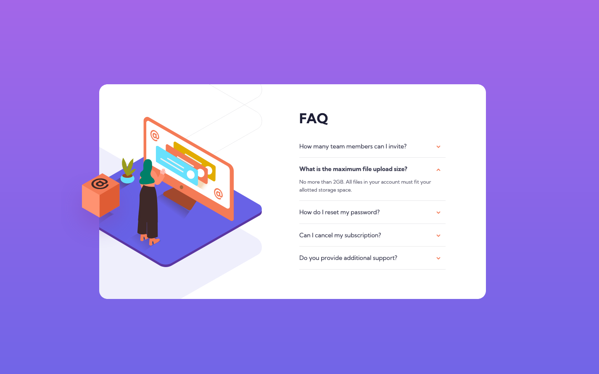

# Frontend Mentor - FAQ accordion card solution

This is a solution to the [FAQ accordion card challenge on Frontend Mentor](https://www.frontendmentor.io/challenges/faq-accordion-card-XlyjD0Oam). Frontend Mentor challenges help you improve your coding skills by building realistic projects.

## Table of contents

- [Frontend Mentor - FAQ accordion card solution](#frontend-mentor---faq-accordion-card-solution)
  - [Table of contents](#table-of-contents)
  - [Overview](#overview)
    - [The challenge](#the-challenge)
    - [Screenshot](#screenshot)
    - [Links](#links)
    - [Built with](#built-with)
    - [Continued development](#continued-development)
    - [Useful resources](#useful-resources)
  - [Author](#author)

## Overview

### The challenge

- Use of CH Unit in CSS
- Use of Flexbox and CSS Grid

Users should be able to:

- View the optimal layout depending on their device's screen size

### Screenshot

### Links

- Solution URL: [Solution](https://github.com/AGutierrezR/faq-accordion-card)
- Live Site URL: [Live Site](https://agutierrezr.github.io/faq-accordion-card/)

### Built with

- Semantic HTML5 markup
- CSS custom properties
- Flexbox
- CSS Grid
- Mobile-first workflow
- [Sass](https://sass-lang.com/) - For styles

### Continued development

- Screenreader only text

### Useful resources

- [A Complete Guide to Flexbox](https://css-tricks.com/snippets/css/a-guide-to-flexbox/) - This helped me with the layout.
- [A Complete Guide to Grid](https://css-tricks.com/snippets/css/complete-guide-grid/) - This helped me with the layout.

## Author

- Website - [Andres Gutierrez](https://agutierrezr.github.io/)
- Frontend Mentor - [@AGutierrezR](https://www.frontendmentor.io/profile/AGutierrezR)
- Twitter - [@AGutierrezr_](https://twitter.com/AGutierrezr_)
